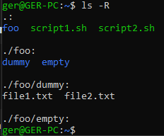

# Ejercicio 1

### Crea mediante comandos de bash la siguiente jerarquía de ficheros y directorios

```bash
foo/
├─ dummy/
│  ├─ file1.txt
│  ├─ file2.txt
├─ empty/
```

Donde `file1.txt` debe contener el siguiente texto:

```bash
Me encanta la bash!!
```

Y `file2.txt` debe permanecer vacío.

### Solución

```bash
# Creamos las carpetas y los ficheros
mkdir -p foo/{dummy,empty} && touch foo/dummy/{file1.txt,file2.txt}

# Introducimos el texto correspondiente a file1.txt
echo 'Me encanta la bash!!' > foo/dummy/file1.txt

# Comprobamos que contiene el texto
cat foo/dummy/file1.txt

# Comprobamos también que se ha creado correctamente la estructura
ls -R
```


