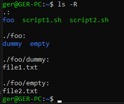

# Ejercicio 2

### Mediante comandos de bash, vuelca el contenido de file1.txt a file2.txt y mueve file2.txt a la carpeta empty

El resultado de los comandos ejecutados sobre la jerarquía anterior deben dar el siguiente resultado.

```bash
foo/
├─ dummy/
│  ├─ file1.txt
├─ empty/
  ├─ file2.txt
```

Donde `file1.txt` y `file2.txt` deben contener el siguiente texto:

```bash
Me encanta la bash!!
```

### Solución

```bash
# Copiamos el contenido de un fichero a otro
cat foo/dummy/file1.txt > foo/dummy/file2.txt

# Nos movemos hacia la carpeta "dummy"
cd foo/dummy/

# Movemos el fichero "file2.txt" a la carpeta "empty"
mv file2.txt ../empty/

# Comprobamos la nueva estructura, así como el contenido de cada fichero
cd
ls -R
cat foo/dummy/file1.txt > foo/dummy/file2.txt
cat foo/dummy/file1.txt > foo/dummy/file2.txt
```

