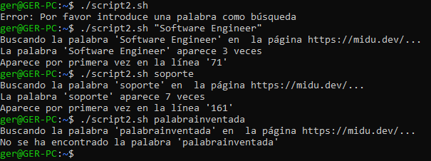

# Ejercicio 4

### Crea un script de bash que descargue el contenido de una página web a un fichero y busque en dicho fichero una palabra dada como parámetro al invocar el script

La URL de dicha página web será una constante en el script.

Si tras buscar la palabra no aparece en el fichero, se mostrará el siguiente mensaje:

```bash
$ ejercicio4.sh patata
> No se ha encontrado la palabra "patata"
```

Si por el contrario la palabra aparece en la búsqueda, se mostrará el siguiente mensaje:

```bash
$ ejercicio4.sh patata
> La palabra "patata" aparece 3 veces
> Aparece por primera vez en la línea 27
```

### Solución

```bash
# Creamos el script "script2.sh"
touch script2.sh

# Le añadimos para todas las opciones de permisos el permiso de ejecución
chmod +x script2.sh

# Comprobamos los permisos
ls -al script2.sh

# Editamos el script
vim script2.sh

# Lógica de "script2.sh"
########################################################
#!/bin/bash

if [ -z "$1" ]; then
  echo "Error: Por favor introduce una palabra como búsqueda"
  exit 1
fi

URL="https://midu.dev/"
PALABRA="$1"
FICHERO="pagina_descargada.html"

curl -s "$URL" -o "$FICHERO"

echo "Buscando la palabra '$PALABRA' en  la página $URL..."
LINEA=$(grep -in "$PALABRA" "$FICHERO" | head -n 1 | cut -d: -f1) # Muestra el número de línea de la primera aparición
COINCIDENCIAS=$(grep -io "$PALABRA" "$FICHERO" | wc -l) # Cuenta el número total de coincidencias

if [ "$COINCIDENCIAS" -gt 0 ]; then
    echo "La palabra '$PALABRA' aparece $COINCIDENCIAS veces"
    echo "Aparece por primera vez en la línea '$LINEA'"
else
    echo "No se ha encontrado la palabra '$PALABRA'"
fi
########################################################

# Ejecutamos el script
./script2.sh # ❌
./script2.sh "Software Engineer" # ✅
./script2.sh soporte # ✅
./script2.sh palabrainventada # ✅
```

