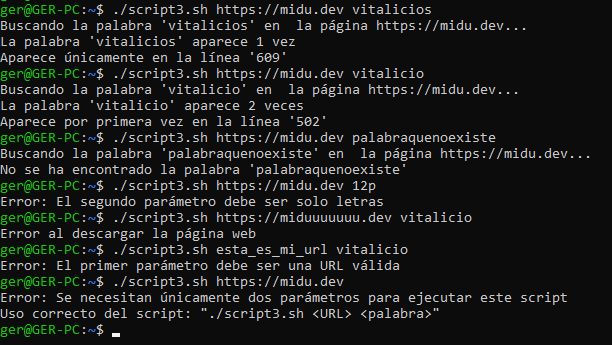

# Ejercicio 5

### OPCIONAL - Modifica el ejercicio anterior de forma que la URL de la página web se pase por parámetro y también verifique que la llamada al script sea correcta

Si al invocar el script este no recibe dos parámetros (URL y palabra a buscar), se deberá de mostrar el siguiente mensaje:

```bash
$ ejercicio5.sh https://lemoncode.net/ patata 27
> Se necesitan únicamente dos parámetros para ejecutar este script
```

Además, si la palabra sólo se encuentra una vez en el fichero, se mostrará el siguiente mensaje:

```bash
$ ejercicio5.sh https://lemoncode.net/ patata
> La palabra "patata" aparece 1 vez
> Aparece únicamente en la línea 27
```

### Solución

```bash
# A partir del ejercicio anterior le añadimos mejoras al "script2.sh" y creamos el "script3.sh"
vim script3.sh

# Lógica de "script3.sh"
########################################################
#!/bin/bash

# $# Cantidad de argumentos pasados -> not equal 2
if [ "$#" -ne 2 ]; then
  echo "Error: Se necesitan únicamente dos parámetros para ejecutar este script" 
  echo "Uso correcto del script: \"$0 <URL> <palabra>\""
  exit 1
fi

# Valida que el primer parámetro tenga forma de URL
if [[ ! "$1" =~ ^https?://.+ ]]; then
  echo "Error: El primer parámetro debe ser una URL válida"
  exit 1
fi

# Valida que el segundo parámetro sea solo letras (mayúsculas o minúsculas)
if [[ ! "$2" =~ ^[a-zA-Z]+$ ]]; then
  echo "Error: El segundo parámetro debe ser solo letras"
  exit 1
fi

# Definimos las constantes
URL="$1"
PALABRA="$2"
FICHERO="pagina_descargada.html"

# Descargamos la página web
curl -s "$URL" -o "$FICHERO"
if [ $? -ne 0 ]; then
  echo "Error al descargar la página web"
  exit 2
fi

# Buscamos la palabra en el fichero
echo "Buscando la palabra '$PALABRA' en  la página $URL..."
LINEA=$(grep -in "$PALABRA" "$FICHERO" | head -n 1 | cut -d: -f1) # Muestra el número de línea de la primera aparición
COINCIDENCIAS=$(grep -io "$PALABRA" "$FICHERO" | wc -l) # Cuenta el número total de coincidencias

# Comprobamos si se encontró la palabra
if [ "$COINCIDENCIAS" -gt 0 ]; then
  if [ "$COINCIDENCIAS" -eq 1 ]; then
    echo "La palabra '$PALABRA' aparece 1 vez"
    echo "Aparece únicamente en la línea '$LINEA'"
  else
    echo "La palabra '$PALABRA' aparece $COINCIDENCIAS veces"
    echo "Aparece por primera vez en la línea '$LINEA'"
  fi
else
    echo "No se ha encontrado la palabra '$PALABRA'"
fi
########################################################

# Ejecutamos el script
./script3.sh https://midu.dev vitalicios # ✅
./script3.sh https://midu.dev vitalicio # ✅
```

Como se puede observar se han añadido validadores en el caso de que los parámetros no sean los esperados (Una URL y una palabra) o directamente no se introduzcan el número de parámetros esperado, así como el manejo de errores en el caso de que no se realice correctamente la llamada curl.

```bash
./script3.sh https://midu.dev 12p # ❌
./script3.sh https://miduuuuuuuu.dev vitalicio # ❌
./script3.sh esta_es_mi_url vitalicio # ❌
./script3.sh https://midu.dev # ❌
```

